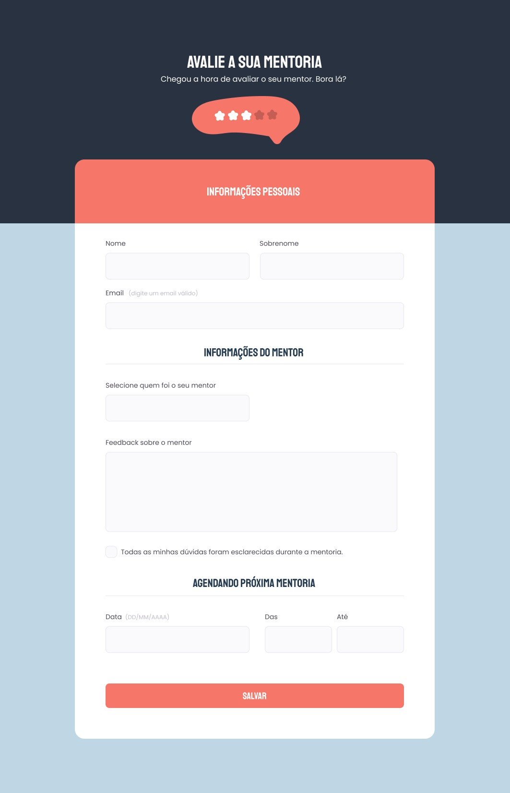

<h1 align="center"> Stage 03 - Criando Formulários</h1>

 

  

## 🖥️ Tecnologias

Esse projeto foi desenvolvido com as seguintes tecnologias:

- HTML
- CSS
- Git e Github
- Figma

## 📂 Projeto

  O Desafio é a criação de um formulário básico para feedback de mentorias.

 

## 🔖 Layout

Você pode visualizar o layout do projeto através [DESSE LINK](https://www.figma.com/file/fnZyJHs7eqNFAA7tUrKcsD/Stage-03---Formul%C3%A1rio-avan%C3%A7ado/duplicate). É necessário ter conta no [Figma](https://figma.com) para acessá-lo.

  

